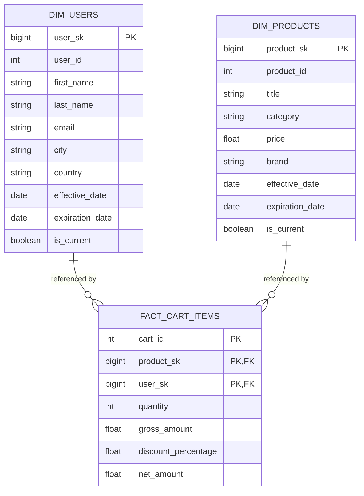

# Databricks E-Commerce Lakehouse

An end-to-end Lakehouse pipeline on **Azure Databricks** that ingests e-commerce data from a REST API, structures it through a **Bronze → Silver → Gold Medallion architecture** on **Delta Lake**, and models a dimensional **star schema** Gold layer using **MERGE INTO**, hybrid **SCD Type 1 / Type 2** logic, and Delta Lake **surrogate keys** — orchestrated end-to-end as a **Databricks Workflow**. Bronze supports two load paths: direct paginated API ingestion, and a file-staged landing zone loaded via **COPY INTO**.

**Repo:** [github.com/hashtagAftab/databricks-ecommerce-lakehouse](https://github.com/hashtagAftab/databricks-ecommerce-lakehouse)

## Why this project

Built to practice the full lifecycle of a Lakehouse pipeline — authenticated API ingestion, layered transformation, and dimensional modeling — on a real (if small) dataset, rather than a toy CSV, and to get hands-on with patterns (MERGE-based SCD, surrogate keys, Workflow orchestration) that come up repeatedly in production Data Engineering work.

## Architecture

```text
DummyJSON API (token-authenticated, paginated)
        |
        |----------------------------------------+
        v                                        v
   Bronze  <---- COPY INTO ---- landing zone (JSON files)
   (raw ingestion, schema-enforced,
    ingestion metadata)
        |
        v
   Silver  ── flattened, cleaned, standardized, exploded to row grain
        |
        v
   Gold    ── star schema: dim_users, dim_products, fact_cart_items
        |
        v
  (Power BI reporting — planned, not yet built)
```

Bronze can be loaded either directly from the paginated API response, or by first staging responses as JSON in a landing volume and bulk-loading them into Bronze with `COPY INTO` — both paths are implemented and land in the same Bronze tables.

## Repository structure

```text
src/
├── api_utils.py       # authenticate() + fetch_data(): token auth, paginated GET requests
├── config.py          # endpoints, page size, catalog/schema/path config
└── schemas.py         # explicit PySpark StructType schema per endpoint

notebooks/
├── bronze_ingestions.ipynb        # paginated ingestion into Bronze Delta tables
├── generate_landing_data.ipynb    # same ingestion, written to JSON in a landing volume
├── bronze_copy_into.ipynb         # loads the landing-zone JSON files into Bronze via COPY INTO
├── silver_transformations.ipynb   # flattening, renaming, exploding to Silver tables
├── dim_products.ipynb             # Gold: dim_products (MERGE INTO, SCD1+SCD2, surrogate key)
├── dim_users.ipynb                # Gold: dim_users (MERGE INTO, SCD1+SCD2, surrogate key)
└── fact_cart_items.ipynb          # Gold: fact_cart_items (joins current dims + cart data)
```

## What each layer does

### Ingestion (`src/`, `bronze_ingestions.ipynb`)
- Authenticates against the API and retrieves a bearer token.
- Pulls from 8 endpoints (`products`, `carts`, `users`, `posts`, `comments`, `quotes`, `todos`, `recipes`) using `limit`/`skip` pagination, looping until all records for each endpoint are retrieved.
- Applies an explicit PySpark schema (`StructType`) per endpoint rather than relying on schema inference.
- Writes to Bronze Delta tables with `ingestion_timestamp` and `source_system` metadata columns, creating the table on first run and appending on subsequent runs.

### Landing zone (`generate_landing_data.ipynb`)
- Same authenticated, paginated ingestion, but writes each page of results as a JSON file to a landing volume path, one file per endpoint/offset. Demonstrates the file-first pattern used when data needs to land in storage before a file-based or incremental load step.

### Bronze via COPY INTO (`bronze_copy_into.ipynb`)
- A second Bronze-loading path: creates the empty, schema-enforced Bronze tables (if they don't already exist), then runs `COPY INTO` for each endpoint to bulk-load the JSON files staged by `generate_landing_data.ipynb` from the landing volume into the corresponding Bronze Delta table.
- `COPY INTO` tracks which files have already been loaded, so re-running it against the same landing path doesn't reprocess or duplicate files already ingested — giving file-level idempotency without custom bookkeeping.
- This sits alongside `bronze_ingestions.ipynb` as an alternate route into the same Bronze layer: one path writes directly from the paginated API response, the other stages to files first and bulk-loads via `COPY INTO`.

### Silver (`silver_transformations.ipynb`)
- Flattens deeply nested JSON structures (address, company, hair, bank, crypto sub-objects on the `users` bronze table; nested product line items on `carts`).
- Standardizes column names to snake_case.
- Explodes array fields — cart line items and product reviews — down to row-level grain.
- Casts types (e.g., string dates to `date`).

### Gold (`dim_products.ipynb`, `dim_users.ipynb`, `fact_cart_items.ipynb`)
- `dim_products` and `dim_users` are built with a single `MERGE INTO` statement that applies **both** SCD patterns in one pass:
  - **SCD Type 2** for attributes where history matters (e.g., price/discount on products; name/address on users) — expires the current row (`expiration_date`, `is_current = false`) and inserts a new current row.
  - **SCD Type 1** for attributes where only the latest value matters (e.g., stock, rating, contact details) — updates the existing row in place.
- Surrogate keys (`user_sk`, `product_sk`) are generated with Delta Lake's `GENERATED ALWAYS AS IDENTITY`.
- `fact_cart_items` joins the current (`is_current = true`) dimension rows to the Silver cart data to build a fact table at the grain of **one row per product per cart**.

### Gold layer star schema




*(Dimension tables shown with a representative subset of columns — both `dim_users` and `dim_products` carry additional attributes in the actual implementation; see the notebooks for the full column list. `fact_cart_items`' natural key is the combination of `cart_id`, `product_sk`, and `user_sk`, matching the stated grain of one row per product per cart.)*

### Orchestration
The Bronze → Silver → Gold flow is deployed as a **Databricks Workflow (Job)**, with tasks (ingestion → silver transformations → dim_products/dim_users in parallel → fact_cart_items) running on serverless compute and wired together with task dependencies:


## Version control

Developed with Git and hosted on GitHub, with incremental commits tracking the pipeline's progression — from initial project setup and source utilities, through Bronze ingestion, Silver transformations, and finally the Gold-layer dimension and fact tables.

## Known limitations / honest notes

- **Power BI reporting is planned, not built yet** — the Gold layer is ready to be consumed by a semantic model, but no report currently exists on top of it.
- **`COPY INTO` loads from the landing zone, not directly from the API.** It bulk-loads the JSON files that `generate_landing_data.ipynb` stages in the landing volume — the files themselves are still a full pull each run, not an incremental slice. I explored true source-side incremental strategies (cursor/offset-based, ID-based, date/time-based) but the underlying API doesn't expose the change-tracking fields (e.g., updated-since timestamps) needed to filter at the source; `COPY INTO`'s own file-tracking still avoids reloading files already ingested.
- No CI/CD, automated tests, or monitoring/alerting are set up on this project — it's a portfolio/learning project, not a production system.

## Possible future work

- A working Power BI semantic model on top of the Gold layer.
- Revisiting source-side incremental loads with a data source that supports change tracking (so `COPY INTO`/landing-zone loads pick up only new records, not a full pull each run).
- Basic data quality checks (row-count reconciliation, null/duplicate checks) on the Silver/Gold outputs.

---
**Author:** Md Aftab Alam — [GitHub](https://github.com/hashtagAftab) · [LinkedIn](https://www.linkedin.com/in/aftabhere/)
